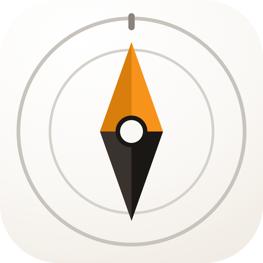
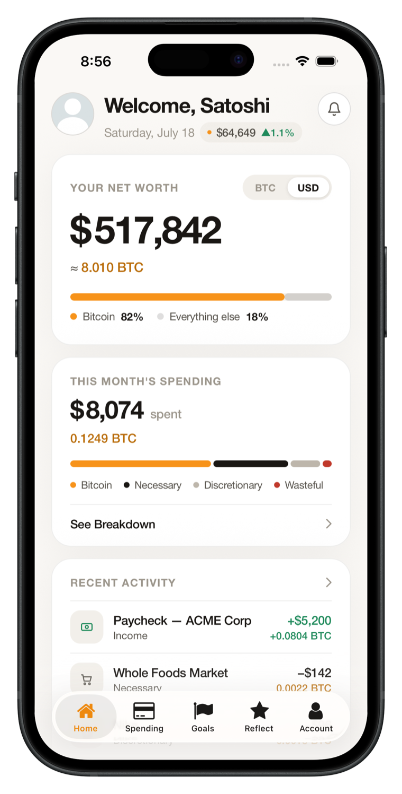

  

  # Compass — Your Financial Life, in Bitcoin.

  *A privacy-first personal finance and budgeting app for Bitcoiners. Track net worth, spending, and goals — denominated in sats, encrypted on your device.*

  
  
  
  

---

## What is Compass?

**Compass** is a Bitcoin-aware budgeting and net worth app for people who already think in sats. Connect a bank, an exchange, or a spreadsheet — Compass tracks your net worth, spending, and goals the way a Bitcoiner actually measures them, not the way a legacy budgeting app assumes you do.

Everything is **encrypted on your own device**. No account is required to use the desktop app. Cloud sync is optional, not default.

> Pay once, own Compass forever — **no subscription, ever.** Pay in Bitcoin or USD. 30-day money-back guarantee.

## Why Compass exists

Most budgeting apps (Mint, YNAB, Monarch, Empower) treat Bitcoin as an afterthought — if they support it at all. If you hold BTC as a meaningful part of your net worth, you end up tracking it in a spreadsheet next to an app that only understands dollars.

Compass was built from the other direction: sats first, fiat as the secondary unit. Your net worth, your spending, your goals — all readable in BTC or your local fiat currency, side by side.

## Features

- **Net worth in BTC and fiat** — see your full financial picture in sats or 8 supported fiat currencies (USD, CAD, AUD, EUR, GBP, INR, JPY, CHF), side by side.
- **Read-only wallet tracking** — track balances via xpub. Your keys never leave your device, and Compass never has the ability to move funds. ([verify this →](https://github.com/HRZN-BTC/compass-core))
- **Spending, categorized in sats** — necessary, discretionary, and wasteful spending, denominated in BTC.
- **Goals** — plan and track savings goals against your Bitcoin accumulation rate.
- **Monthly reflections** — a monthly summary of your accumulation and spending, shareable with the community.
- **Encrypted local storage by default** — your data lives in one encrypted file on your machine. No account, no server, unless you opt into sync.
- **Cross-platform** — desktop (Mac, Windows, Linux) and iOS, with optional encrypted sync between them.
- **Pay in Bitcoin** — lifetime license, purchasable in sats or USD. No recurring charge, ever.

## Screenshot

  

## Compass cannot read your data

Compass is built so that, by design, we can't see your financial data even if we wanted to:

- Your backup is a single encrypted `.compass` file that you own — USB, iCloud, wherever you put it. Restore it on any machine with your passphrase.
- Wallet tracking uses your **xpub**, not your private keys. Compass can watch balances; it can never move funds.

Don't take our word for it — the code that touches your keys and your data is open source:

**→ [HRZN-BTC/compass-core](https://github.com/HRZN-BTC/compass-core)** — xpub derivation, encryption, and license verification, published openly so you can audit the privacy claims yourself. Includes a full [network call log](https://github.com/HRZN-BTC/compass-core/blob/main/NETWORK.md) and [threat model](https://github.com/HRZN-BTC/compass-core/blob/main/SECURITY.md).

The application layer (UI, billing, sync infrastructure) stays closed source — but every line that touches your keys or your data is public.

## Get Compass

| Platform | Link |
|---|---|
| Mac / Windows / Linux | [compassbtc.app/download](https://compassbtc.app/download) |
| iOS | [App Store](https://apps.apple.com/my/app/compass-bitcoin-finance-app/id6776933441) |
| Pricing | [compassbtc.app](https://compassbtc.app) — one-time lifetime license, pay in BTC or USD |

## Related repos

- **[compass-core](https://github.com/HRZN-BTC/compass-core)** — open-source security-critical packages (encryption, xpub derivation, license verification)

## Support

Questions or issues with the app: use the in-app support link, or reach out via [compassbtc.app](https://compassbtc.app).

---

  Built for Bitcoiners who track their net worth the way they already think — in sats.

